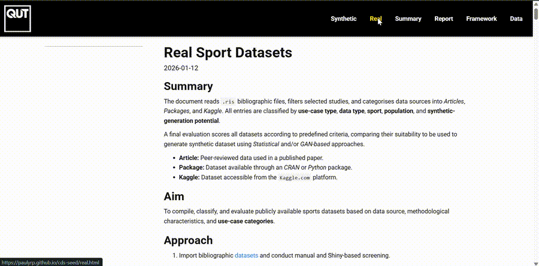
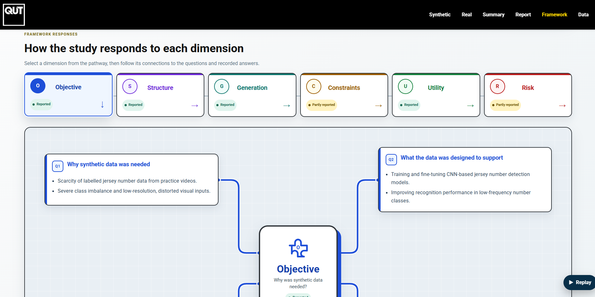

  

# Synthetic Data in Sports

  

This website presents an exploration of common data science applications in sport and the opportunities for integrating synthetic data into research and practice.

**[Explore the website](https://paulyrp.github.io/cds-seed/)**

## Website sections

- **[Synthetic](https://paulyrp.github.io/cds-seed/synthetic.html):** evidence and examples related to synthetic sport datasets.
- **[Real](https://paulyrp.github.io/cds-seed/real.html):** an overview of real-world sport datasets and their characteristics.
- **[Summary](https://paulyrp.github.io/cds-seed/summary.html):** a consolidated summary of the reviewed evidence.
- **[Report](https://paulyrp.github.io/cds-seed/report.html):** the complete report and supporting analysis.
- **[Framework](https://paulyrp.github.io/cds-seed/framework.html):** an interactive framework for examining synthetic data projects.
- **[Data](https://paulyrp.github.io/cds-seed/data.html):** the records and supporting information used by the website.

## Framework

The framework provides interactive boxes allowing users to review supporting evidence and open linked sources.

  

